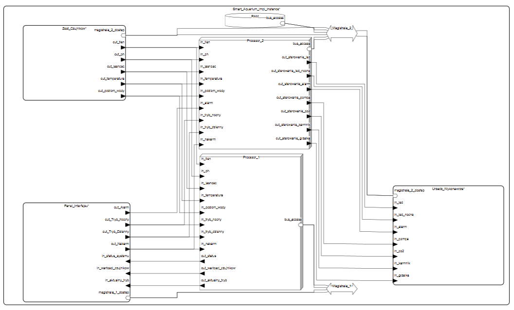
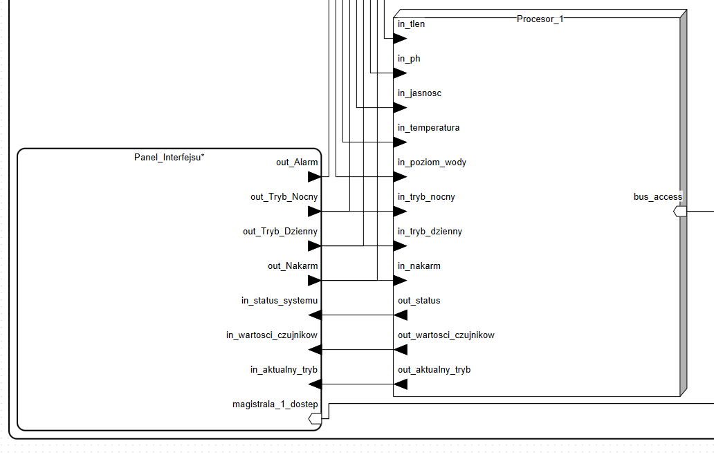
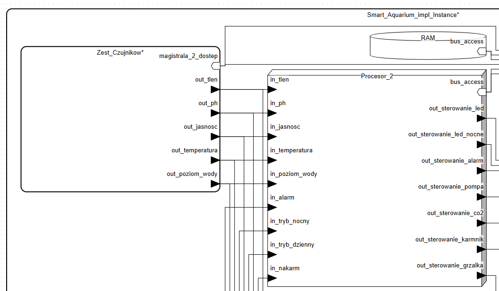
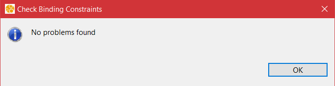
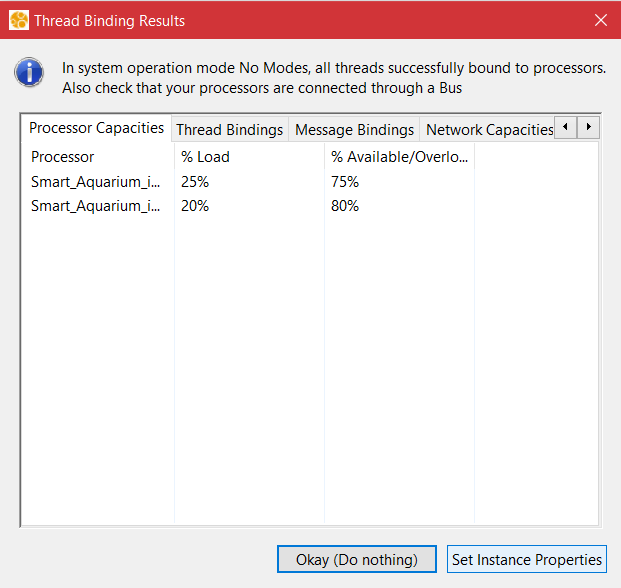

# 🐠 Model Systemu Sterowania Smart Akwarium (AADL)

Projekt przedstawia architekturę systemu automatycznego zarządzania akwarium, modelowaną w języku AADL (Architecture Analysis & Design Language) w środowisku OSATE.

---

## 1.  Dane Projektowe

* **Imię i Nazwisko:** Norbert Groń
* **E-mail:** `gron@student.agh.edu.pl`
* **Grupa:** Gr. 1, godz. 11.30

---

## 2.  Opis i Założenia Modelowanego Systemu

System realizuje zarządzanie środowiskiem akwarium, automatycznie reagując na odczyty z czujników oraz polecenia użytkownika.

### 2.1. Podsystemy Funkcjonalne

| Podsystem | Rola |
| :--- | :--- |
| **Panel\_UI** (Interfejs użytkownika) | Przyjmowanie poleceń (tryby, karmienie) i wyświetlanie stanu/danych. |
| **Zestaw\_Czujnikow** | Monitorowanie parametrów: temperatura, poziom wody, tlen, jasność, pH. |
| **Urzadzenia\_Wykonawcze** | Sterowanie fizycznymi elementami: oświetlenie dzienne i nocne, grzałka, pompa, CO2, karmnik, alarm. |

### 2.2. Architektura Procesorów

System działa na dwóch procesorach:

* **`Procesor_Glowny_Panel`**: Odpowiada za obsługę interfejsu użytkownika i wyświetlanie danych.
* **`Procesor_Glowny_Urzadzenia`**: Odpowiada za logikę sterowania urządzeniami na podstawie danych z czujników i danych wejściowych z panelu HMI.

### 2.3. Wątki

Cała logika przetwarzania sygnałów i danych opiera się na jednolitym wątku **`Watek_Sygnalu`**, zdefiniowanej parametrami:

* **Protokół:** `Periodic` (Okresowy)
* **Okres (`Period`):** 100 ms
* **Czas Wykonania:** 2–5 ms
* **Deadline:** 100 ms

### 2.4. Kluczowe Założenia Projektowe

* **Izolacja Logiki:** Oddzielenie procesorów (Panel/Urządzenia). W przypadku awarii Panelu, logika sterowania urządzeniami może działać autonomicznie.
* **Komunikacja:** Magistrale danych jest modelowana idealnie (brak opóźnień i ograniczeń przepustowości).
* **Dane:** Sygnały są abstrakcyjne i nie mają modelowanych wartości liczbowych.

---

## 3.  Spis Komponentów AADL

### 3.1. Komponenty Sprzętowe (Hardware)

| Typ | Komponenty |
| :--- | :--- |
| **`processor`** | `Procesor_Glowny_Panel`, `Procesor_Glowny_Urzadzenia` |
| **`bus`** | `Magistrala_1` , `Magistrala_2`|

### 3.2. Komponenty Oprogramowania (Software)

| Typ | Komponenty |
| :--- | :--- |
| **`process`** | `Proces_Przyciskow`, `Proces_Czujnikow` |
| **`thread`** | `Watek_Sygnalu` |

### 3.3. Urządzenia (Device)

| Kategoria | Komponenty |
| :--- | :--- |
| **Wejściowe (Przyciski)** | `Przycisk_Trybu` (x2), `Przycisk_Karmienia` |
| **Wyjściowe (Wyświetlacze)** | `Wyswietlacz_Trybu`, `Wyswietlacz_Statusu`, `Wyswietlacz_Czujnikow` |
| **Czujniki** | `Czujnik_Temperatury`, `Czujnik_Poziomu_Wody`, `Czujnik_Tlenu`, `Czujnik_Jasnosci`, `Czujnik_pH` |
| **Wykonawcze** | `Oświetlenie_LED`, `Oświetlenie_LED_Nocne`, `Grzalka`, `Pompa`, `CO2`, `Karmnik`, `Brzeczyk_Alarmowy` |

---

# 4. Spis komponentów AADL

W projekcie wykorzystano następujące komponenty z języka AADL do odwzorowania rzeczywistych elementów inteligentnego akwarium:

### System (`system`)
Najwyższy poziom hierarchii. Reprezentuje całe akwarium oraz jego główne podsystemy funkcjonalne.
* `Smart_Aquarium`: Główny system integrujący wszystkie podsystemy, procesory, pamięć i magistrale.
* `Panel_UI`: Podsystem interfejsu użytkownika, łączący przyciski sterujące i wyświetlacze informacyjne.
* `Zestaw_Czujnikow`: Podsystem monitorujący parametry środowiskowe wody.
* `Urzadzenia_Wykonawcze`: Podsystem grupujący wszystkie elementy fizyczne realizujące akcje w akwarium.

### Procesor (`processor`)
Modeluje jednostki obliczeniowe wykonujące kod sterujący.
* `Procesor_Glowny_Panel`: Odpowiada za przetwarzanie sygnałów z panelu UI oraz wysyłanie danych do wyświetlaczy.
* `Procesor_Glowny_Urzadzenia`: Odpowiada za logikę automatyki – analizuje dane z czujników i na ich podstawie steruje urządzeniami wykonawczymi.

### Pamięć (`memory`)
Komponent reprezentujący zasoby pamięciowe w systemie.
* `Pamiec_RAM`: Pamięć operacyjna podłączona do magistrali, służąca do buforowania odczytów z czujników i przechowywania stanu systemu.

### Magistrala (`bus`)
Medium transmisyjne łączące komponenty.
* `Magistrala_1`: Modeluje połączenia komunikacyjne. W systemie wykorzystano dwie instancje: `Magistrala_1` (łącząca Panel i Procesor 1) oraz `Magistrala_2` (łącząca Czujniki, Urządzenia, Pamięć i Procesor 2).

### Urządzenie (`device`)
Komponenty fizyczne niezbędne do funkcjonowania akwarium. Podzielono je na trzy kategorie:
* **Wejścia (Interfejs):** Urządzenia, przez które użytkownik wydaje polecenia: `Przycisk_Trybu`, `Przycisk_Karmienia`.
* **Czujniki:** Urządzenia dostarczające danych środowiskowych: `Czujnik_Temperatury`, `Czujnik_Poziomu_Wody`, `Czujnik_Tlenu`, `Czujnik_Jasnosci`, `Czujnik_pH`.
* **Wyjścia/Elementy wykonawcze:** Urządzenia realizujące pracę lub prezentujące dane: `Wyswietlacz`, `Oswietlenie_LED` (dzienne), `Oswietlenie_LED_Nocne`, `Grzalka`, `Pompa_Obiegowa`, `Zbiornik_CO2`, `Karmnik_Automatyczny`, `Brzeczyk_Alarmowy`.

### Proces (`process`)
Logiczna jednostka oprogramowania zawierająca wątki. Odpowiada za dzielenie zasobów pamięci.
* `Proces_Przyciskow`: Zarządza przetwarzaniem sygnałów wejściowych z przycisków panelu.
* `Proces_Czujnikow`: Zarządza zbieraniem i przetwarzaniem surowych danych z czujników.

### Wątek (`thread`)
Najmniejsza jednostka wykonawcza, realizująca konkretne zadania w czasie rzeczywistym.
* `Watek_Sygnalu`: Uniwersalny wątek przetwarzający sygnały w systemie.
* **Właściwości czasowe:** Zgodnie z kodem źródłowym zdefiniowano:
    * `Dispatch_Protocol => Periodic` (Uruchamianie cykliczne)
    * `Period => 100 ms` (Częstotliwość odświeżania 10Hz)
    * `Compute_Execution_Time => 2 ms .. 5 ms` (Czas zajętości procesora)
    * `Deadline => 100 ms` (Wymagany czas zakończenia zadania przed kolejnym cyklem)
---
# 5. Model - rysunek

Poniżej przedstawiono diagram głównego systemu Akwarium, wnętrza poszczególnych podsystemów i procesów.

### Diagram systemowy

Ogólny obraz systemu

### Diagram wnętrza podsystemu

Przykładowy obraz podsystemu, do odważnych świat należy czy coś

### Diagramy opisujące flow informacji

---

## 6.  Testy funkcjonalne

**Poniżej przedstawiono wyniki dwóch analiz,**

Binding Constraints, sprawdzająca czy wszystko jest ze sobą poprawnie połączone 

Thread Binding sprawdzające czy wątki są odpowienio przypisane do procesów

Wszystkie testy odbyły się pomyślnie, połączenia są dobrze zrobione, a wątki nie są nazbyt obciążone

--

## 7.  Dodatkowe Informacje

### 7.1. Założenia Projektowe

Przyjęto następujące uproszczenia i założenia dla modelu:

* **Idealna komunikacja:** Magistrala danych (`Magistrala_Danych`) jest modelowana jako medium idealne – nie wprowadza opóźnień transmisji ani ograniczeń przepustowości.
* **Praca ciągła:** System zaprojektowano do pracy w trybie ciągłym (*continuous operation*), bez przewidzianej procedury wyłączania.
* **Abstrakcja danych:** Sygnały przesyłane w systemie (typ `Sygnal`) mają charakter abstrakcyjny (zdarzeniowy) i nie posiadają modelowanych wartości liczbowych (np. konkretnej temperatury w stopniach Celsjusza).
* **Niezależność UI:** Interfejs użytkownika (Panel) działa niezależnie od logiki sterującej (Urządzenia), co pozwala na asynchroniczne odświeżanie stanu.
* Decyzja o zastosowaniu **dwóch odrębnych procesorów** (`Procesor_Glowny_Panel` oraz `Procesor_Glowny_Urzadzenia`), powoduje, że UI jest oddzielone od warstwy wykonawczej, i w przypadku uszkodzenia wyświetlacza, funkcje podtrzymania życia realizowane są zgodnie z ostatnią podaną instrukcją

---

## 8.  Literatura

Model został opracowany w oparciu o następujące źródła:

1.  Feiler, P. H., & Gluch, D. P. (2012). *Model-Based Engineering with AADL*. Addison-Wesley.
2.  [Dokumentacja środowiska OSATE](https://osate.org)
3.  Materiały wykładowe z kursu *Systemy Czasu Rzeczywistego*.
